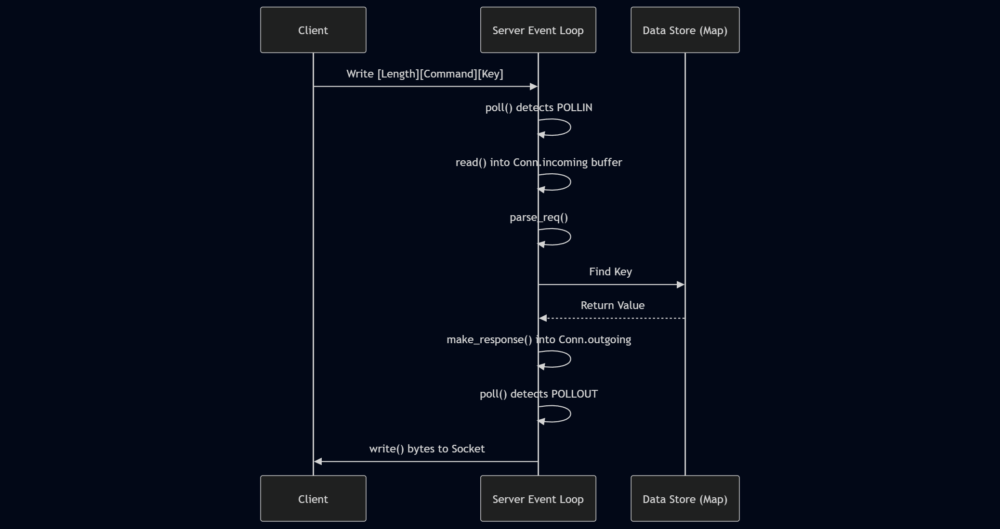
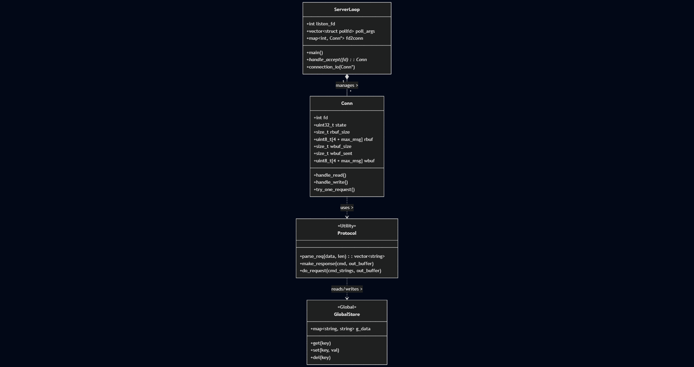

# redis-lite
A high-performance, in-memory key-value store built from scratch in C++. Implements a custom TCP server using raw sockets to replicate core Redis functionality without external dependencies.
**Redis-Lite** is a project to build a lightweight, high-performance in-memory key-value store from scratch. The goal is to deconstruct the internal architecture of databases like Redis to understand the complexities of network programming, memory management, and asynchronous I/O at the system level.

## 1. Engineering Decisions

### Why C++?
This project is built in C++ specifically to prioritize **control** and **performance**:
* **Zero-Overhead Abstraction:** Unlike Python or Java, C++ compiles directly to machine code without a Garbage Collector (GC), ensuring predictable latency—critical for a database.
* **System-Level Access:** The project requires direct manipulation of OS primitives (sockets, file descriptors, memory pages). C++ provides the raw pointer access needed to optimize how bytes are aligned and stored.
* **Memory Management:** Building a database requires fine-grained control over memory allocation to prevent fragmentation and leaks, which C++ enables manually.

### Why Custom Protocols?
Instead of using HTTP/REST frameworks (like Flask or Express), this project uses raw TCP sockets. This is to minimize the packet overhead and handle the raw byte streams directly, mimicking how production-grade databases handle low-level communication.

---
> **Current Version:** v1.0 (Reactor Pattern with `poll`)
> **Status:** Stable Core

## ⚡ Features

* **Core Commands:** Supports `GET`, `SET`, and `DEL`.
* **Event-Driven:** Uses a single-threaded event loop to handle concurrent connections efficiently.
* **Non-Blocking I/O:** Hand-rolled buffering system (`incoming`/`outgoing` queues) to handle partial reads/writes without blocking.
* **Pipelining:** Capable of processing multiple requests in a single network packet.
* **Protocol:** Custom TLV (Type-Length-Value) binary protocol.

---

## 🏗️ Technical Architecture

### 1. The Reactor Pattern (Event Loop)
Unlike traditional blocking servers that spawn a thread per client, **redis-lite** uses a single thread to manage all connections. It utilizes the `poll()` system call to monitor the state of multiple file descriptors simultaneously.

**Request Lifecycle:**
1.  **Poll:** The server waits for `POLLIN` (readable) or `POLLOUT` (writable) events.
2.  **Read:** Data is read into a connection-specific buffer (`Conn.incoming`).
3.  **Parse & Execute:** The protocol parser constructs a command, executes it against the global map, and generates a response.
4.  **Write:** The response is queued in `Conn.outgoing` and written when the socket is ready.



### 2. Class Design
The system is designed around the `Conn` struct, which acts as a state container for each client.

* **ServerLoop:** Manages the `poll_args` vector and the lifecycle of file descriptors.
* **Conn:** Encapsulates the socket `fd`, protocol state (`want_read/write`), and raw byte buffers.
* **GlobalStore:** A wrapper around `std::map<string, string>` providing O(log n) data access.



---

## 🚀 Getting Started

### Prerequisites
* Linux/macOS (POSIX compliant)
* g++ (C++11 or later)

### Building
```bash
# Compile the server
g++ -Wall -Wextra -O2 -g server.cpp -o server

# Compile the client
g++ -Wall -Wextra -O2 -g client.cpp -o client
