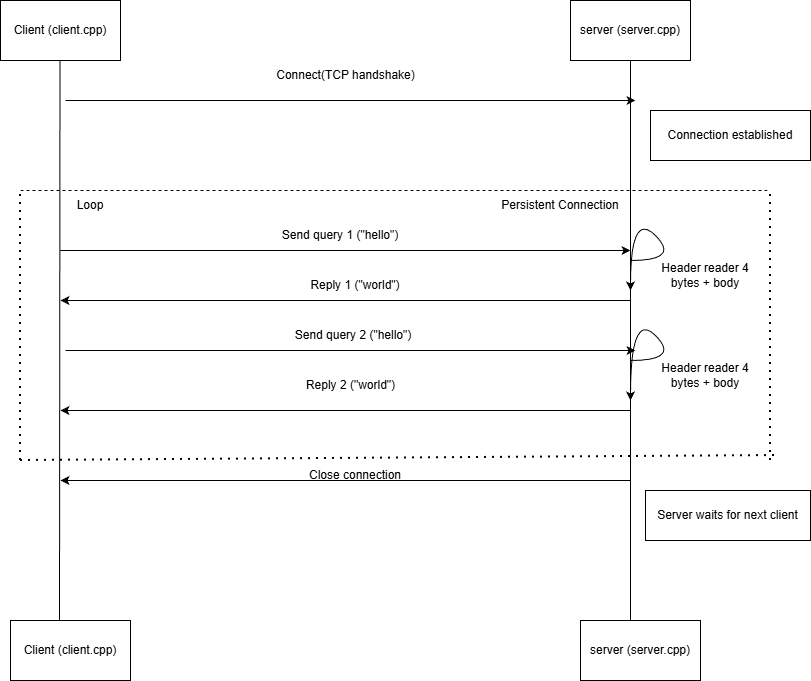

# redis-lite
A high-performance, in-memory key-value store built from scratch in C++. Implements a custom TCP server using raw sockets to replicate core Redis functionality without external dependencies.
**Redis-Lite** is a project to build a lightweight, high-performance in-memory key-value store from scratch. The goal is to deconstruct the internal architecture of databases like Redis to understand the complexities of network programming, memory management, and asynchronous I/O at the system level.

## 1. Engineering Decisions

### Why C++?
This project is built in C++ specifically to prioritize **control** and **performance**:
* **Zero-Overhead Abstraction:** Unlike Python or Java, C++ compiles directly to machine code without a Garbage Collector (GC), ensuring predictable latency—critical for a database.
* **System-Level Access:** The project requires direct manipulation of OS primitives (sockets, file descriptors, memory pages). C++ provides the raw pointer access needed to optimize how bytes are aligned and stored.
* **Memory Management:** Building a database requires fine-grained control over memory allocation to prevent fragmentation and leaks, which C++ enables manually.

### Why Custom Protocols?
Instead of using HTTP/REST frameworks (like Flask or Express), this project uses raw TCP sockets. This is to minimize the packet overhead and handle the raw byte streams directly, mimicking how production-grade databases handle low-level communication.

---

## 2. Architecture: v0.2 (Persistent Connection)
*Current Version: v0.2 - Protocol Framing & Event Loop*

In v0.1, the server closed connections after a single request. v0.2 introduces a **Length-Prefixed Protocol** and a **Nested Loop Architecture** to handle persistent connections, allowing clients to send multiple commands in a single session.

### Protocol Design (Custom Application Layer)
TCP is a byte stream, meaning message boundaries are not guaranteed. To distinguish between messages, I implemented a custom framing protocol:
* **Header (4 bytes):** Little-endian integer specifying the length of the body.
* **Body (N bytes):** The actual payload.

**Packet Structure:**
`[ Length (4B) ] [ Payload (N Bytes) ]`

### System Design
The server now employs a "Connection Loop" separate from the "Request Loop":
1.  **Accept Phase:** The outer loop waits for a TCP handshake.
2.  **Request Phase:** Once connected, an inner `while(true)` loop continuously reads the 4-byte header, determines the message size, and processes the command.
3.  **Teardown:** The inner loop breaks only when the client disconnects or a protocol violation occurs.

**Sequence Diagram:**
 

### Key Technical Implementation
* **Buffer Management:** Implemented `read_full()` and `write_all()` wrappers to handle partial kernel I/O, ensuring strict adherence to the protocol length.
* **Protocol Safety:** The server validates the length header against `k_max_msg` (4096 bytes) to prevent buffer overflow attacks.
* **Pipeline Ready:** This architecture lays the groundwork for Pipelining (sending multiple requests without waiting for replies), a core Redis feature.

