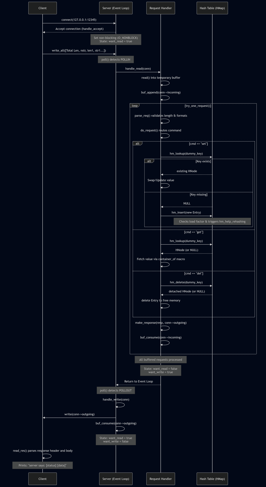
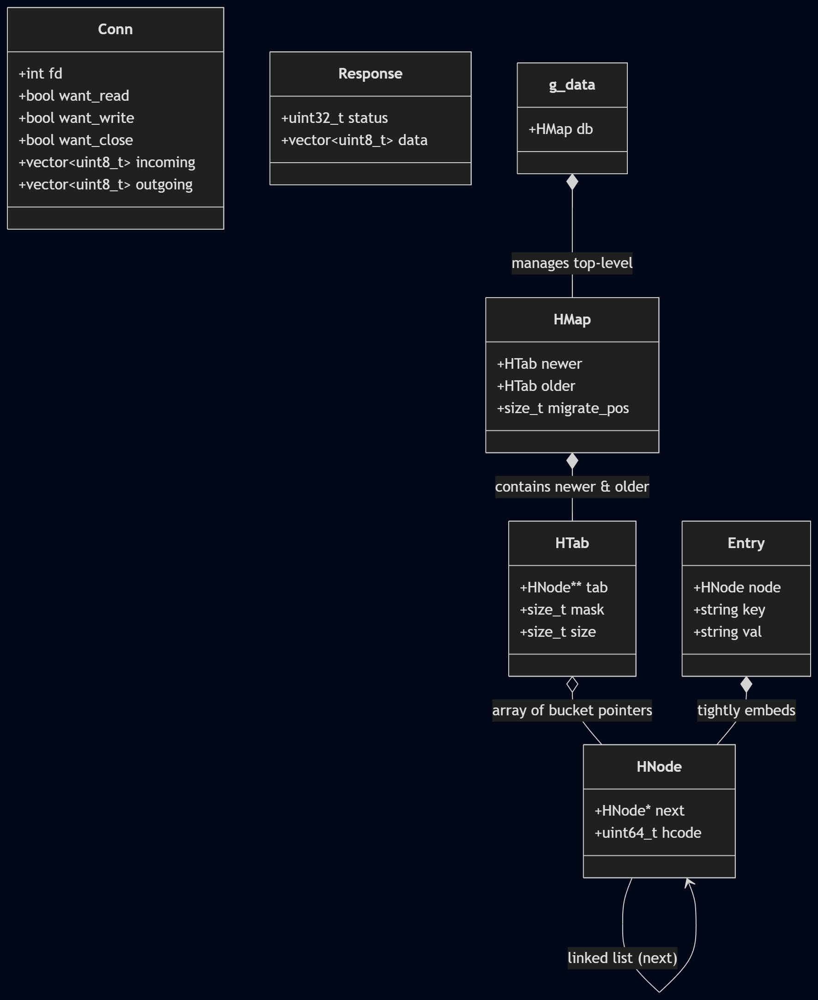

# redis-lite
A high-performance, in-memory key-value store built from scratch in C++. Implements a custom TCP server using raw sockets and a custom progressively rehashing dictionary to replicate core Redis functionality without external dependencies.

**Redis-Lite** is a project to build a lightweight, high-performance in-memory key-value store from scratch. The goal is to deconstruct the internal architecture of databases like Redis to understand the complexities of network programming, memory management, intrusive data structures, and asynchronous I/O at the system level.

## 1. Engineering Decisions

### Why C++?
This project is built in C++ specifically to prioritize **control** and **performance**:
* **Zero-Overhead Abstraction:** Unlike Python or Java, C++ compiles directly to machine code without a Garbage Collector (GC), ensuring predictable latency—critical for a database.
* **System-Level Access:** The project requires direct manipulation of OS primitives (sockets, file descriptors, memory pages). C++ provides the raw pointer access needed to optimize how bytes are aligned and stored.
* **Memory Management:** Building a database requires fine-grained control over memory allocation to prevent fragmentation and leaks, allowing the custom data structures to operate efficiently.

### Why Custom Protocols & Data Structures?
Instead of using HTTP/REST frameworks or standard library containers (`std::map`, `std::unordered_map`), this project builds them from the ground up. Handling raw byte streams over TCP minimizes packet overhead. Furthermore, the custom hash table ensures absolute control over the rehashing mechanics, eliminating "stop-the-world" latency spikes that occur during standard dictionary resizing.

---
> **Current Version:** v1.1 (Custom Hash Table & Progressive Rehashing)
> **Status:** Stable Core

## ⚡ Features

* **O(1) Custom Dictionary:** Hand-rolled hash table utilizing the FNV-1a hashing algorithm for rapid lookups.
* **Progressive Rehashing:** Distributes the cost of hash table resizing across multiple event loop iterations to maintain flat latency.
* **Intrusive Data Structures:** Uses embedded nodes (`HNode`) and the `container_of` macro to completely decouple memory allocation from dictionary linking mechanics.
* **Event-Driven & Non-Blocking:** Uses a single-threaded event loop (`poll()`) and hand-rolled buffering (`incoming`/`outgoing` queues) to efficiently handle concurrent connections.
* **Pipelining:** Capable of processing multiple commands packed into a single network packet.

---

## 🏗️ Technical Architecture

### 1. The Reactor Pattern (Event Loop)
Unlike traditional blocking servers that spawn a thread per client, **redis-lite** uses a single thread to manage all connections. It utilizes the `poll()` system call to monitor the state of multiple file descriptors simultaneously.

**Request Lifecycle:**
1.  **Poll:** The server waits for `POLLIN` (readable) or `POLLOUT` (writable) events.
2.  **Read:** Data is read non-blockingly into a connection-specific buffer (`Conn.incoming`).
3.  **Parse & Execute:** The protocol parser extracts commands, routes them to the custom hash table, triggers any necessary progressive rehashing steps, and generates a response.
4.  **Write:** The response is queued in `Conn.outgoing` and written back to the client only when the socket is writable.



### 2. Class Design & The Data Layer
The system is designed to strictly separate the network state from the storage engine, utilizing an intrusive architecture for the data layer.

* **Conn:** Encapsulates the socket `fd`, explicit protocol intent state (`want_read`/`want_write`), and raw byte buffers for incoming/outgoing streams.
* **HMap & HTab:** The custom dictionary manager that holds two tables (`newer` and `older`) to facilitate seamless, non-blocking migrations during resizes.
* **Entry:** The application payload that stores the string key/value pairs. It intrusively embeds the `HNode` struct, allowing the hash table to manage linked lists of pointers while the application resolves the full data payload using the `container_of` macro.



---

## 🚀 Getting Started

### Prerequisites
* Linux/macOS (POSIX compliant)
* `g++` (C++11 or later)
* `make`

### Building
```bash
# Compile both the server and the client
make

# Or compile individually
make server
make client