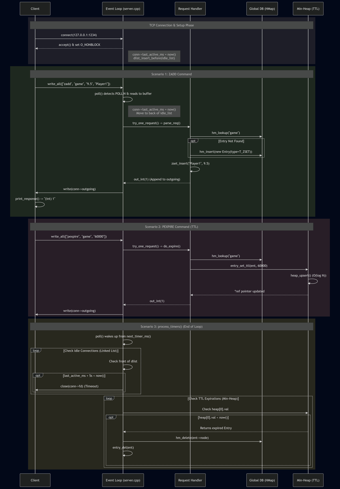
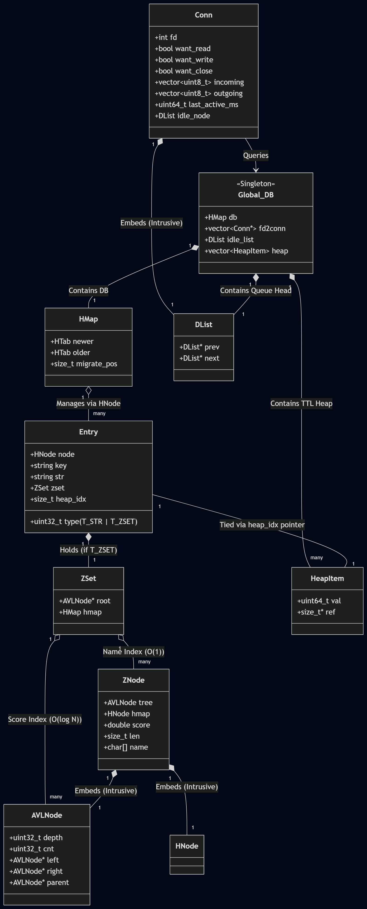

# redis-lite
A high-performance, in-memory key-value store built from scratch in C++. Implements a custom TCP server using raw sockets and a custom progressively rehashing dictionary to replicate core Redis functionality without external dependencies.

**Redis-Lite** is a project to build a lightweight, high-performance in-memory key-value store from scratch. The goal is to deconstruct the internal architecture of databases like Redis to understand the complexities of network programming, memory management, intrusive data structures, and asynchronous I/O at the system level.

## 1. Engineering Decisions

### Why C++?
This project is built in C++ specifically to prioritize **control** and **performance**:
* **Zero-Overhead Abstraction:** Unlike Python or Java, C++ compiles directly to machine code without a Garbage Collector (GC), ensuring predictable latency—critical for a database.
* **System-Level Access:** The project requires direct manipulation of OS primitives (sockets, file descriptors, memory pages). C++ provides the raw pointer access needed to optimize how bytes are aligned and stored.
* **Memory Management:** Building a database requires fine-grained control over memory allocation to prevent fragmentation and leaks, allowing the custom data structures to operate efficiently.

### Why Custom Protocols & Data Structures?
Instead of using HTTP/REST frameworks or standard library containers (`std::map`, `std::unordered_map`), this project builds them from the ground up. Handling raw byte streams over TCP minimizes packet overhead. Furthermore, the custom hash table ensures absolute control over the rehashing mechanics, eliminating "stop-the-world" latency spikes that occur during standard dictionary resizing.

---
> **Current Version:** v2.0 (Timers, TTL & Cache Expiration)
> **Status:** Stable Core, Protocol Upgraded, Multi-Structure Data Layer, Autonomous Resource Management

## ⚡ Features

* **O(1) Custom Dictionary:** Hand-rolled hash table utilizing the FNV-1a hashing algorithm for rapid lookups.
* **Progressive Rehashing:** Distributes the cost of hash table resizing across multiple event loop iterations to maintain flat latency.
* **Dual-Intrusive Sorted Sets:** Implements an advanced `ZSet` using both an AVL Tree and a Hash Table simultaneously. The custom `ZNode` intrusively embeds both `AVLNode` and `HNode` to provide $O(1)$ point lookups and $O(\log N)$ range queries.
* **Order Statistic Tree Math:** The AVL tree tracks subtree node counts (`cnt`), enabling mathematical branch-skipping to achieve ultra-fast $O(\log N)$ offset calculations for large database queries.
* **Zero-Overhead Allocations:** Utilizes C-style Flexible Array Members (`char name[0]`) to store structures and their string payloads in a single, contiguous block of heap memory.
* **Event-Driven & Non-Blocking:** Uses a single-threaded event loop (`poll()`) and hand-rolled buffering (`incoming`/`outgoing` queues) to efficiently handle concurrent connections.
* **Pipelining:** Capable of processing multiple commands packed into a single network packet.
* **O(1) Idle Connection Management:** Tracks client inactivity using a custom intrusive Doubly Linked List, automatically terminating stale connections to prevent resource exhaustion.
* **Min-Heap Cache Expiration (TTL):** Supports precise key expiration (`PEXPIRE`, `PTTL`) managed by a highly efficient, array-encoded Min-Heap, guaranteeing O(1) lookups for the next expiring key.

---

## 🏗️ Technical Architecture

### 1. The Reactor Pattern (Event Loop)
Unlike traditional blocking servers that spawn a thread per client, **redis-lite** uses a single thread to manage all connections. It utilizes the `poll()` system call to monitor the state of multiple file descriptors simultaneously, with a dynamic timeout tied to the nearest database event.

**Request Lifecycle:**
1.  **Calculate Timeout:** The server queries both the idle connection linked list and the TTL Min-Heap to calculate exactly how many milliseconds `poll()` can sleep before the next timer expires.
2.  **Poll:** The server waits for `POLLIN` (readable), `POLLOUT` (writable), or timer expiration events.
3.  **Read:** Data is read non-blockingly into a connection-specific buffer (`Conn.incoming`).
4.  **Parse & Execute:** The protocol parser extracts commands, routes them to the custom hash table, updates corresponding TTL timers in the heap, and generates a response.
5.  **Write:** The response is queued in `Conn.outgoing` and written back to the client only when the socket is writable.
6.  **Cleanup:** At the end of every loop, a `process_timers()` routine prunes expired connections and evicts expired database keys.



### 2. Class Design & The Data Layer
The system is designed to strictly separate the network state from the storage engine, utilizing a polymorphic, intrusive architecture for the data layer and unified background timer states.

* **Conn:** Encapsulates the socket `fd`, explicit protocol intent state (`want_read`/`want_write`), raw byte buffers, and embeds a `DList` node to track its position in the idle timeout queue.
* **Global_DB:** The central state manager holding the hash table (`HMap`), the idle connection queue head (`idle_list`), and the flat array backing the TTL binary tree (`std::vector<HeapItem> heap`).
* **HMap & HTab:** The custom dictionary manager that holds two tables (`newer` and `older`) to facilitate seamless, non-blocking migrations during resizes.
* **Entry (Polymorphic Payload):** The top-level database container. It embeds an `HNode` for global linking, tracks its own location in the TTL heap via `heap_idx`, and uses a `type` tag (`T_STR` or `T_ZSET`) to safely hold either string primitives or complex `ZSet` structures. 
* **ZSet & ZNode:** The Sorted Set implementation. A `ZSet` manages both an `HMap` (for name indexing) and an `AVLNode` tree root (for score sorting). The `ZNode` payload intrusively embeds both networking nodes alongside a Flexible Array Member for contiguous string storage.



## 🚀 Getting Started

### Prerequisites
* Linux/macOS (POSIX compliant)
* `g++` (C++11 or later)
* `make`
* `python3` (for running integration tests)

### Building
The project uses a `Makefile` to compile the core AVL tree logic into a static library (`libavl.a`), which is then linked to the server and client executables.

```bash
# Clean previous builds
make clean

# Compile the static library, the server, and the client
make